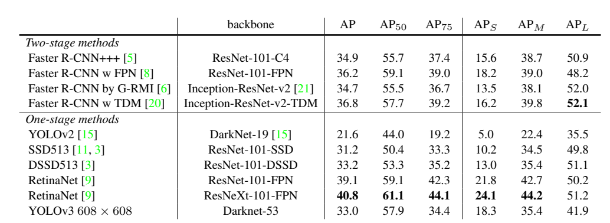
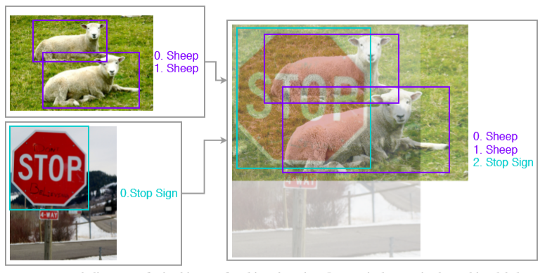
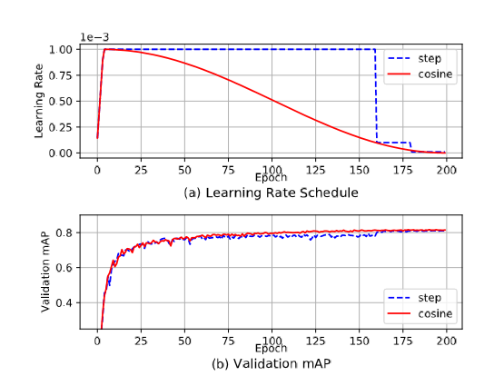
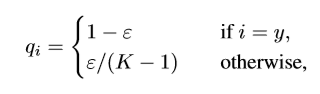
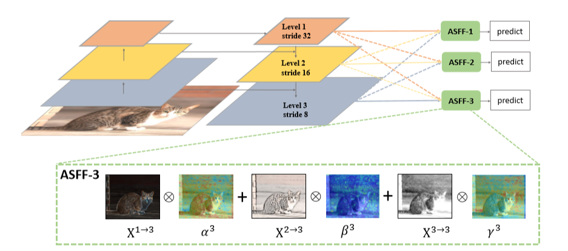
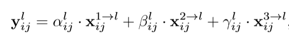
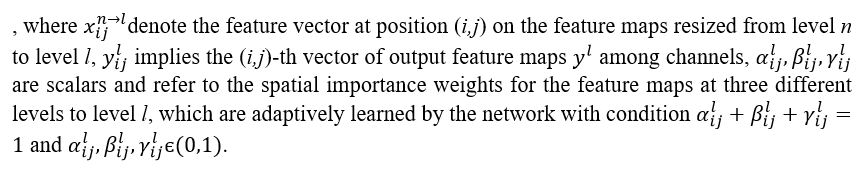
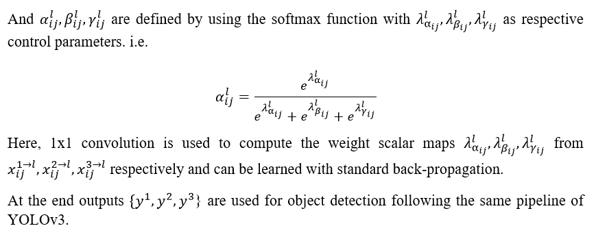

YOLOv3 is a popular and fast object detection algorithm, but unfortunately not as accurate as RetinaNet or Faster RCNN, which you can see in the image below. In this article I will discuss two simple yet powerful approaches suggested in recent object detection literature to improve YOLOv3. These are: 
1) [Different Training Heuristics for Object Detection](https://arxiv.org/abs/1902.04103), and 
2) [Adaptive Spatial Fusion of Feature Pyramids](https://arxiv.org/abs/1911.09516)

We will look at them one by one. Let's dig into it.


_Source YOLOv3 Paper_

## Different Training Heuristics for Object Detection
The performance of image classification networks has improved a lot with the use of refined training procedures. A brief discussion of these training tricks can be found [here](https://openaccess.thecvf.com/content_CVPR_2019/papers/He_Bag_of_Tricks_for_Image_Classification_with_Convolutional_Neural_Networks_CVPR_2019_paper.pdf) from CPVR 2019. Similarly, for object detection networks, some have suggested different training heuristics (1), like:

- Image mix-up with geometry preserved alignment
- Using cosine learning rate scheduler
- Label smoothing
- Synchronized batch normalization
- Data augmentation

These modifications improved the mAP@(.5:.9) score of YOLOv3 from 33.0 to 37.0 without any extra computation cost during inference, and a negligible increase in computation cost during training (1). The improved YOLOv3 with pre-trained weights can be found [here](https://gluon-cv.mxnet.io/model_zoo/detection.html). To understand the intuition behind these heuristics, we will look at them one by one.

### Image_Mixup
Let's start with [mixup](https://arxiv.org/abs/1710.09412) training. In image classification networks, image mixup is just the linear interpolation of the pixels of two images (e.g. the left image below). The distribution of blending ratio in the mixup algorithm for image classification is drawn from a [beta distribution](https://en.wikipedia.org/wiki/Beta_distribution), B(0.2, 0.2), which is also used to mix up one-hot image labels using the same ratio. For performing the mix-up both images have to be of the same dimensions so they are generally resized, however this would require bounding boxes of objects present in images to be resized as well. To avoid this hassle, a new image mix-up strategy is used. It takes an image of max width and max height out of the two images, with pixel values equal to 0 to 255, and adds the linear interpolation of two images to it. For this mixup strategy, blending ratios were obtained from the beta distribution B(1.5, 1.5) because (1) found that for object detection B(1.5, 1.5) gives a visually coherent mixed-up image and empirically better mAP score. Object labels are merged as a new array. This is demonstrated below. Now we have one method of mixup for image classification, and another for object detection.


_Image Classification Mixup_


_Object Detection Mixup_

Natural co-occurrence of objects in training images plays a significant role in the performance of object detection networks. For instance, a bowl, a cup, and a refrigerator should appear together more frequently than a refrigerator and an elephant. This makes detecting an object outside of its typical environment difficult. Using image mixup with an increased blending ratio makes the network more robust to such detection problems. Mixup also acts as a regularizer and forces the network to favor simple linear behavior.
```python
def object_det_mix_up_(image1, image2, mixup_ratio):

    '''
    image1, image2: images to be mixed up, type=ndarray
    mixup_ratio: ratio in which two images are mixed up
    Returns a mixed-up image with new set of smoothed labels
    '''
    
    height = max(image1.shape[0], image2.shape[0])
    width = max(image1.shape[1], image2.shape[1])
    mix_img = np.zeros((height, width, 3),dtype=np.float32)
    mix_img[:image1.shape[0], :image1.shape[1], :] = image1.astype(np.float32) * mixup_ratio
    mix_img[:image2.shape[0], :image2.shape[1], :] += image2.astype(np.float32) * (1-mixup_ratio)
    return mix_img
```
_Image Mixup Code_

### Learning Rate Scheduler
Most of the popular object detection networks (Faster RCNN, YOLO, etc.) use a learning rate scheduler. According to (1), the resulting sharp learning rate transition may cause the optimizer to re-stabilize the learning momentum in the following iterations. Using a cosine scheduler (where the learning rate decreases slowly) with proper warmup (two epochs) can give even better validation accuracy than using a step scheduler, shown below.


_Comparison of step scheduler vs cosine scheduler on the PASCAL VOC 2007 test set_ [source](https://arxiv.org/abs/1902.04103)

### Classification Head Label Smoothing
In label smoothing we convert our one-hot encoded labels to a smooth probability distribution using:


_[source](https://arxiv.org/abs/1902.04103)_

Where K is the number of classes, ε is a small constant, and q is the ground truth distribution. This acts as a regularizer by reducing the model’s confidence.

### Synchronized Batch Normalisation
In current deep convolutional architectures, batch normalization is considered an essential layer. It's responsible for speeding up the training process and making the network less sensitive to weight initialization by [normalizing the activations](https://www.youtube.com/watch?v=nUUqwaxLnWs) of hidden layers. Due to large input image size, presence of feature pyramid architectures, and a large number of candidate object proposals (in case of multi-stage networks), the batch sizes one can fit on a single GPU become very small (i.e. less than 8 or so images per batch).

In the distributed training paradigm, the hidden activations are normalized within each GPU. This causes the calculation of noisy mean and variance estimates, which hinders the whole batch normalization process. [Synchronized batch normalization](https://arxiv.org/pdf/1711.07240.pdf) has therefore been suggested to help increase the batch size by considering activations over several GPUs for the calculation of statistical estimates. As a result, this makes the calculations less noisy.

Synchronized batch normalization can be achieved easily using the [Apex](https://github.com/NVIDIA/apex) library from NVIDIA for mixed-precision and distributed training in PyTorch. We can also convert any standard `BatchNorm` module in PyTorch to `SyncBatchNorm` using the `convert_syncbn_model` method, which recursively traverses the passed module and its children to replace all instances of `torch.nn.modules.batchnorm._BatchNorm` with `apex.parallel.SyncBatchNorm`, where `apex.parallel.SyncBatchNorm` is a PyTorch module to perform synchronized batch norm on NVIDIA GPUs.

```python
import apex
sync_bn_model = apex.parallel.convert_syncbn_model(model)
```
_Converting standard batch normalization to synchronized batch normalization in PyTorch using Apex_

### Data Augmentation
Data augmentation techniques also seem to improve object detection models, although they improve single-stage detectors more than the multi-stage detectors. According to (1), the reason behind this is that in multi-stage detectors like Faster-RCNN, where a certain number of candidate object proposals are sampled from a large pool of generated ROIs, the detection results are produced by repeatedly cropping the corresponding regions on feature maps. Due to this cropping operation, multi-stage models substitutes the operation of randomly cropping input images, hence these networks do not require extensive geometric augmentations applied during the training stage.

Empirically, augmentation methods like random cropping (with constraints), expansion, horizontal flip, resize (with random interpolation), and color jittering (including brightness, hue, saturation, and contrast) work better during training. During testing, images are just resized by randomly choosing one of the popular interpolation techniques and then normalizing.

```python
def horizontal_flip(image, boxes):
	''' 
    Flips the image and its bounding boxes horizontally
    '''

    _, width, _ = image.shape
    if random.randrange(2):
        image = image[:, ::-1]
        boxes = boxes.copy()
        boxes[:, 0::2] = width - boxes[:, 2::-2]
    return image, boxes
    

def random_crop(image, boxes, labels, ratios = None):
	''' 
    Performs random crop on image and its bounding boxes 
    '''

    height, width, _ = image.shape

    if len(boxes)== 0:
        return image, boxes, labels, ratios

    while True:
        mode = random.choice((
            None,
            (0.1, None),
            (0.3, None),
            (0.5, None),
            (0.7, None),
            (0.9, None),
            (None, None),
        ))

        if mode is None:
            return image, boxes, labels, ratios

        min_iou, max_iou = mode
        if min_iou is None:
            min_iou = float('-inf')
        if max_iou is None:
            max_iou = float('inf')

        for _ in range(50):
            scale = random.uniform(0.3,1.)
            min_ratio = max(0.5, scale*scale)
            max_ratio = min(2, 1. / scale / scale)
            ratio = math.sqrt(random.uniform(min_ratio, max_ratio))
            w = int(scale * ratio * width)
            h = int((scale / ratio) * height)


            l = random.randrange(width - w)
            t = random.randrange(height - h)
            roi = np.array((l, t, l + w, t + h))

            iou = matrix_iou(boxes, roi[np.newaxis])

            if not (min_iou <= iou.min() and iou.max() <= max_iou):
                continue

            image_t = image[roi[1]:roi[3], roi[0]:roi[2]]

            centers = (boxes[:, :2] + boxes[:, 2:]) / 2
            mask = np.logical_and(roi[:2] < centers, centers < roi[2:]) \
                     .all(axis=1)
            boxes_t = boxes[mask].copy()
            labels_t = labels[mask].copy()
            if ratios is not None:
                ratios_t = ratios[mask].copy()
            else:
                ratios_t=None

            if len(boxes_t) == 0:
                continue

            boxes_t[:, :2] = np.maximum(boxes_t[:, :2], roi[:2])
            boxes_t[:, :2] -= roi[:2]
            boxes_t[:, 2:] = np.minimum(boxes_t[:, 2:], roi[2:])
            boxes_t[:, 2:] -= roi[:2]

            return image_t, boxes_t,labels_t, ratios_t
```
_Several data augmentations to be applied during training_

```python
def preproc_for_test(image, input_size, mean, std):
	''' 
    Data Augmentation applied during testing/validation 
    :image: an ndarray object
    :input_size: tuple of int with two elements (H,W) of image
    :mean: mean of training dataset or image_net rgb mean
    :std: standard deviation of training dataset or imagenet rgb std 
    '''
    
    interp_methods = [cv2.INTER_LINEAR, cv2.INTER_CUBIC, cv2.INTER_AREA, cv2.INTER_NEAREST, cv2.INTER_LANCZOS4]
    interp_method = interp_methods[random.randrange(5)]
    image = cv2.resize(image, input_size,interpolation=interp_method)
    image = image.astype(np.float32)
    image = image[:,:,::-1]
    image /= 255.
    if mean is not None:
        image -= mean
    if std is not None:
        image /= std
    return image.transpose(2, 0, 1)
```
_Data augmentation to be applied for testing/validation_

Other than above heuristics, training YOLOv3 model at different scales of input image like, {320 x 320; 352 x 352 ; 384 x 384; 416 x 416; 448 x 448; 480 x 480; 512 x 512; 544 x 544; 576 x 576; 608 x 608 }, reduces the risk of overfitting and improves model’s generalization capabilities, just like in standard YOLOv3 training. These changes have improved YOLOv3 performance a lot, but next we will look at another approach called Adaptive Spatial Fusion of Feature Pyramids. If combined with these training heuristics, this technique can make YOLOv3 perform even better than baselines like Faster RCNN or Mask RCNN (2).

## Adaptive Spatial Fusion of Feature Pyramids

Object detection networks that use feature pyramids make predictions at different scales of features, or the fusion of different scales of features. For instance, YOLOv3 makes predictions at three different scales with strides 32, 16 and 8. In other words, if given an input image of 416 x 416, it makes predictions on scales of 13 x 13, 26 x 26, and 52 x 52.

Low-resolution features have high semantic value, while high-resolution features have semantically low value. Low-resolution feature maps also contain grid cells that cover larger regions of the image and are, therefore, more suitable for detecting larger objects. On the contrary, grid cells from higher resolution feature maps are better for detecting smaller objects. This means that detecting objects of different scales using features of only one scale is difficult. To combat this issue, detection can be done on different scales individually to detect objects of different scales like in single shot detector ([SSD](https://towardsdatascience.com/review-ssd-single-shot-detector-object-detection-851a94607d11)) architecture. However, although the approach requires little extra cost in computation, it is still sub-optimal since the high-resolution feature maps cannot sufficiently obtain semantic features from the images. Architectures like RetinaNet, YOLOv3, etc. therefore combine both high and low semantic value features to create a semantically and spatially strong feature. Performing detection on those features presents a better trade-off between speed and accuracy.

Combining different resolution features is done by concatenating or adding them element-wise. Some have suggested an approach to combine these feature maps in a manner so that only relevant information from each scale feature map is kept for combination (2). The figure below summarizes this. In short, instead of making predictions on features at each level like in standard YOLOv3, features from the three levels are first rescaled and then adaptively combined at each level, and then prediction/detection is performed on those new features.

To understand this better we will look at the two important steps of this approach: 
1) Identical Rescaling and 
2) Adaptive Feature Fusion.


_Illustration of Adaptive Spatial Fusion of Feature Pyramids ([source](https://arxiv.org/abs/1911.09516))_

### Identical Rescaling

All features at each level are rescaled and their number of channels are adjusted. Suppose an input image of size 416 x 416 has been given as input, and we have to combine features at level 2 (where the feature map size is 26 x 26 and number of channels is 512) with the higher-resolution features at level 3 (resolution 52 x 52, number of channels 256). This layer would then be downsampled to 26 x 26 while the number of channels is increased to 512. On the other hand, the features at the lower-resolution level 1 (resolution 13 x 13, number of channels 1024) would be upsampled to 26 x 26 whereas the number of channels would be reduced to 512.

For up-sampling, first a 1 x 1 convolution layer is applied to compress the number of channels of features, and then upscaling is done with interpolation. For down-sampling with a 1/2 ratio, a 3 x 3 convolution layer with a stride of 2 is used to modify the number of channels and the resolution simultaneously. For the scale ratio of 1/4, a 2-stride max pooling layer before the 2-stride convolution is used. The code below defines and performs these operations using PyTorch.

```python
def add_conv(in_ch, out_ch, ksize, stride, leaky=True):
    """
    Add a conv2d / batchnorm / leaky ReLU block.
    Args:
        in_ch (int): number of input channels of the convolution layer.
        out_ch (int): number of output channels of the convolution layer.
        ksize (int): kernel size of the convolution layer.
        stride (int): stride of the convolution layer.
    Returns:
        stage (Sequential) : Sequential layers composing a convolution block.
    """
    stage = nn.Sequential()
    pad = (ksize - 1) // 2
    stage.add_module('conv', nn.Conv2d(in_channels=in_ch,
                                       out_channels=out_ch, kernel_size=ksize, stride=stride,
                                       padding=pad, bias=False))
    stage.add_module('batch_norm', nn.BatchNorm2d(out_ch))
    if leaky:
        stage.add_module('leaky', nn.LeakyReLU(0.1))
    else:
        stage.add_module('relu6', nn.ReLU6(inplace=True))
    return stage
```
_Adds a convolutional block with a sequence of conv, batchnorm and relu layers_

```python
def scaling_ops(level, x_level_0, x_level_1, x_level_2):
	"""
    Performs upscaling/downscaling operation for each level of features
    Args:
        level (int): level number of features.
        x_level_0 (Tensor): features obtained from standard YOLOv3 at level 0.
        x_level_1 (Tensor): features obtained from standard YOLOv3 at level 1.
        x_level_2 (Tensor): features obtained from standard YOLOv3 at level 2.
    Returns:
        resized features at all three levels and a conv block
    """
    dim = [512, 256, 256]
    inter_dim = dim[level]
    if level==0:
        stride_level_1 = add_conv(256, inter_dim, 3, 2)
        stride_level_2 = add_conv(256, inter_dim, 3, 2)
        expand = add_conv(inter_dim, 1024, 3, 1)

        level_0_resized = x_level_0
        level_1_resized = stride_level_1(x_level_1)
        level_2_downsampled_inter = F.max_pool2d(x_level_2, 3, stride=2, padding=1)
        level_2_resized = stride_level_2(level_2_downsampled_inter)
    elif level==1:
        compress_level_0 = add_conv(512, inter_dim, 1, 1)
        stride_level_2 = add_conv(256, inter_dim, 3, 2)
        expand = add_conv(inter_dim, 512, 3, 1)

        level_0_compressed = compress_level_0(x_level_0)
        level_0_resized = F.interpolate(level_0_compressed, scale_factor=2, mode='nearest')
        level_1_resized = x_level_1
        level_2_resized = stride_level_2(x_level_2)
    elif level==2:
        compress_level_0 = add_conv(512, inter_dim, 1, 1)
        expand = add_conv(inter_dim, 256, 3, 1)

        level_0_compressed = compress_level_0(x_level_0)
        level_0_resized = F.interpolate(level_0_compressed, scale_factor=4, mode='nearest')
        level_1_resized = F.interpolate(x_level_1, scale_factor=2, mode='nearest')
        level_2_resized = x_level_2

    return level_0_resized, level_1_resized,level_2_resized, expand
```
_Performs upscaling or downscaling given the level number and set of features_

### Adaptive Feature Fusion

Once features are rescaled, they are combined by taking the weighted average of each pixel of all three rescaled feature maps (assuming the same weight across all channels). These weights are learned dynamically as we train the network. This equation can explain it better:


_[source](https://arxiv.org/abs/1911.09516)_


_[source](https://arxiv.org/abs/1911.09516)_


_[source](https://arxiv.org/abs/1911.09516)_

Here these operations are defined in PyTorch.

```python
def adaptive_feature_fusion(level, level_0_resized, level_1_resized,level_2_resized, expand):
	"""
    Combines the features adaptively.
    Args:
        level (int): level number of features.
        level_0_resized (Tensor): features obtained after rescaling at level 0.
        level_1_resized (Tensor): features obtained after rescaling at at level 1.
        level_2_resized (Tensor): features obtained after rescaling at at level 2.
        expand (Sequential): a conv block
    Returns:
        out (Tensor): new combibed feature on which detection will be performed.
    """
    dim = [512, 256, 256]
    inter_dim = dim[level]
    compress_c = 16  
    weight_level_0 = add_conv(inter_dim, compress_c, 1, 1)
    weight_level_1 = add_conv(inter_dim, compress_c, 1, 1)
    weight_level_2 = add_conv(inter_dim, compress_c, 1, 1)

    weight_levels = nn.Conv2d(compress_c*3, 3, kernel_size=1, stride=1, padding=0)
    level_0_weight_v = weight_level_0(level_0_resized)
    level_1_weight_v = weight_level_1(level_1_resized)
    level_2_weight_v = weight_level_2(level_2_resized)
    levels_weight_v = torch.cat((level_0_weight_v, level_1_weight_v, level_2_weight_v),1)
    levels_weight = weight_levels(levels_weight_v)
    levels_weight = F.softmax(levels_weight, dim=1)

    fused_out_reduced = level_0_resized * levels_weight[:,0:1,:,:]+\
                        level_1_resized * levels_weight[:,1:2,:,:]+\
                        level_2_resized * levels_weight[:,2:,:,:]

    out = expand(fused_out_reduced)
    return out
```
_Performs Adaptive Feature Fusion given rescaled features_

According to (2), newly adapted features filter out the inconsistency across different scales (using adaptive spatial fusion weights) which is a primary limitation of single-shot detectors with feature pyramids. When used with a YOLOv3 model trained using the training heuristics mentioned above, it significantly improves ( gives mAP@(.5:.95) of 42.4 while YOLOv3 baseline  mAP@(.5:.95) is 33.0 on COCO test-dev 2014) (2) the YOLOv3  baseline with only a small increase in computation cost (also measured on COCO test-dev 2014) i.e. from 52 FPS (frames per second) of YOLOv3 baseline to 45.5 FPS (1), during inference. Also, integrating a few other modules like [DropBock](https://arxiv.org/abs/1810.12890), [RFB](https://arxiv.org/abs/1711.07767), etc. on top of adaptive feature fusion, can surpass (2) Faster RCNN and Mask RCNN baselines. One can download the pre-trained weights [here](https://github.com/ruinmessi/ASFF).

## End Notes

In this article we saw how YOLOv3 baseline can be improved significantly by using simple training heuristics for object detection and the novel technique of adaptive feature fusion with either no increase, or only a small increase in the inference cost. These approaches require minimal architectural changes and can be easily integrated. The training heuristics mentioned above can be used directly for fine-tuning a pre-trained YOLOv3 model as well. The improved YOLOv3 certainly offers a better trade-off between speed and accuracy. You can find the complete code to fine-tune YOLOv3 using above mentioned approaches on your custom data [here](https://github.com/SKRohit/Improving-YOLOv3).

### References
1. [Bag of Freebies for Training Object Detection Neural Networks](https://arxiv.org/abs/1902.04103)
2. [Learning Spatial Fusion for Single-Shot Object Detection](https://arxiv.org/abs/1911.09516)