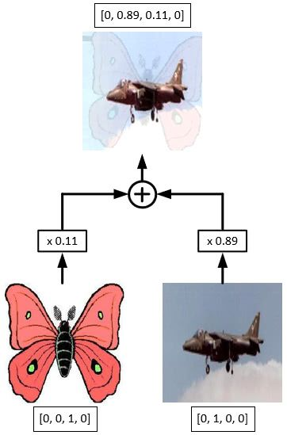

YOLOv3 is a popular and fast object detection algorithm, but unfortunately not as accurate as RetinaNet or Faster RCNN, which you can see in the image below. In this article I will discuss two simple yet powerful approaches suggested in recent object detection literature to improve YOLOv3. These are: 
1) [Different Training Heuristics for Object Detection](https://arxiv.org/abs/1902.04103), and 
2) [Adaptive Spatial Fusion of Feature Pyramids](https://arxiv.org/abs/1911.09516)

We will look at them one by one. Let's dig into it.

_Source YOLOv3 Paper_

## Different Training Heuristics for Object Detection
The performance of image classification networks has improved a lot with the use of refined training procedures. A brief discussion of these training tricks can be found [here](http://openaccess.thecvf.com/content_CVPR_2019/papers/He_Bag_of_Tricks_for_Image_Classification_with_Convolutional_Neural_Networks_CVPR_2019_paper.pdf) from CPVR 2019. Similarly, for object detection networks, some have suggested different training heuristics (1), like:

- Image mix-up with geometry preserved alignment
- Using cosine learning rate scheduler
- Synchronized batch normalization
- Data augmentation
- Label smoothing

These modifications improved the mAP@(.5:.9) score of YOLOv3 from 33.0 to 37.0 without any extra computation cost during inference, and a negligible increase in computation cost during training (1). The improved YOLOv3 with pre-trained weights can be found [here](https://gluon-cv.mxnet.io/model_zoo/detection.html). To understand the intuition behind these heuristics, we will look at them one by one.

### Image_Mixup
Let's start with [mixup](https://arxiv.org/abs/1710.09412) training. In image classification networks, image mixup is just the linear interpolation of the pixels of two images (e.g. the left image below). The distribution of blending ratio in the mixup algorithm for image classification is drawn from a [beta distribution](https://en.wikipedia.org/wiki/Beta_distribution), B(0.2, 0.2), which is also used to mix up one-hot image labels using the same ratio. For performing the mix-up both images have to be of the same dimensions so they are generally resized, however this would require bounding boxes of objects present in images to be resized as well. To avoid this hassle, a new image mix-up strategy is used. It takes an image of max width and max height out of the two images, with pixel values equal to 0 to 255, and adds the linear interpolation of two images to it. For this mixup strategy, blending ratios were obtained from the beta distribution B(1.5, 1.5) because (1) found that for object detection B(1.5, 1.5) gives a visually coherent mixed-up image and empirically better mAP score. Object labels are merged as a new array. This is demonstrated below. Now we have one method of mixup for image classification, and another for object detection.

 {: .left } {: .right }

### ZeRO Optimizer
The ZeRO (Zero Redundancy Optimizer) is a specialized optimizer designed to address memory bottlenecks in large-scale model training. Before going into the details of ZeRO lets us get an overview of the [Adam Optimizer](https://arxiv.org/abs/1412.6980). During training Adam maintains moving average of momentum and variance of each trainable parameter (in FP32 precision) and during mixed precision training, additionally, a copy of parameters are kept in FP32 precisions. These are called optimizer states. DDP replicates such optimizer states along with model parameters across GPUs causing memory redundancy. ZeRO removes such redundancies by partitioning the optimizer states, gradients, and model parameters across multiple devices, enabling the training of models with more parameters. Depending on the kind of parameter partition ZeRO is divided into three stages, each stage offering a progressively more aggressive memory reduction strategy.

In the first stage only optimizer states and in second stage both optimizer states and parameter graidents are partitioned across GPUs respectively. It is always preferred to use ZeRO from second stage of ZeRO. Because when we partition optimizer states, model parameters and optimizer states should be updated only on their respective partitions. For these updates each partition needs the reduced gradients for the corresponding parameters. And gradients are reduced only on the data parallel process (GPUs) responsible for updating the corresponsing parameters. After the reduction, gradients are not required so keeping them in memory in each partitions is waste of HBM. Instead partitioning gradients corresponding to the optimizer states and only keeping those in memory makes sense. At the end all-gather is performed to collect all the updated parameters from all the GPUs. During ZeRO second stage the total communication volume is same as DDP.

> Note: Forward and backward operations doesn't change between DDP and ZeRO in the sense that each GPU performs its own forward and backward in parallel. Main difference lies in the way tensors are stored and communicated to perform parameter updates.
{: .prompt-tip }

In the third stage model parameters are also partitioned among GPUs. Each partition only keeps parameters that it updates. Therefore, during forward propagation it needs to receive the paramters for all other partitions. However, this can be pipelined to avoid memory overhead. Before computing the forward propagation on the part of the model corresponding to a particular partition, the data parallel process responsible for that partition can broadcast the weights to all the data parallel processes. Once the forward propagation for that partition is done, the parameters can be discarded. In other words, we reschedule the parameter all-gather by spreading it across the entire forward propagation, and discarding the parameters once they have been used.  When parameters are required for forward and backward propagation, they are received from appropriate data parallel process (GPU) through broadcast.

### Model/Tensor Parallelism
Model parallelism was first introduced in the Megatron paper by Nvidia. Unlike data parallelism, where the model is replicated across devices, model parallelism splits the model itself across multiple GPUs. This is particularly useful when the model is too large to fit into the memory of a single device. In model parallelism, different layers (or even parts of layers) of the model are assigned to different GPUs, which compute their respective parts of the forward and backward passes. This approach is essential for training extremely large models, such as those with hundreds of billions of parameters.

### Pipeline Parallelism
Pipeline parallelism is a strategy that performs parallelism by dissecting models horizontally across the layers. In this approach, the model is divided into stages, with each stage assigned to a different device. As data passes through the pipeline, each device processes its stage of the model before passing the output to the next device. This allows multiple micro-batches to be processed concurrently, improving overall throughput. Pipeline parallelism can be combined with model and data parallelism for even greater scalability, though it requires careful management of inter-stage communication to minimize idle times and maximize efficiency.

### PyTorch's FSDP
PyTorch's Fully Sharded Data Parallel (FSDP) is a newer distributed training strategy introduced in the PyTorch framework. FSDP shards both the model parameters and optimizer states across all participating devices, reducing memory usage significantly. This method allows training models that would otherwise be too large to fit in memory, even with advanced GPUs. FSDP also supports mixed precision training and can be used in conjunction with other parallelism strategies, making it a versatile option for large-scale distributed training.