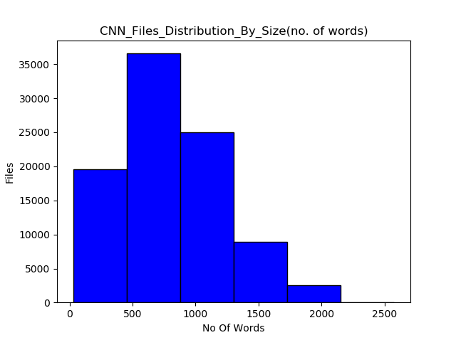
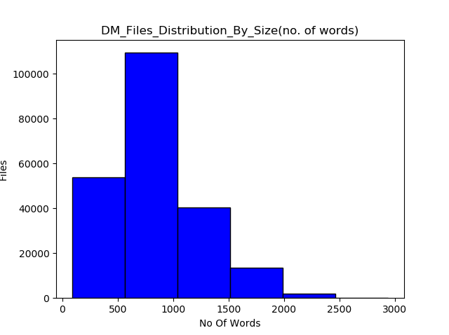
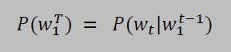
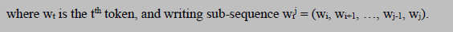
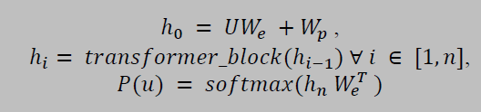
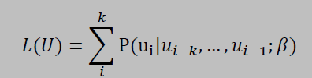
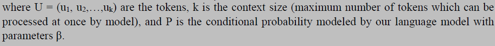
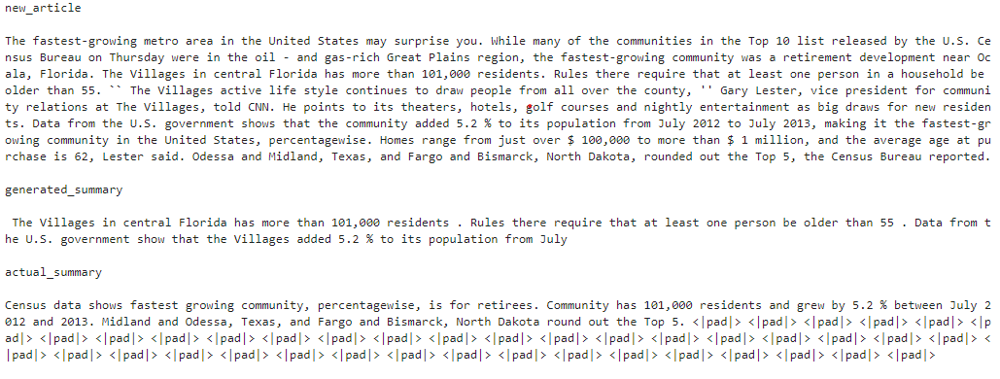
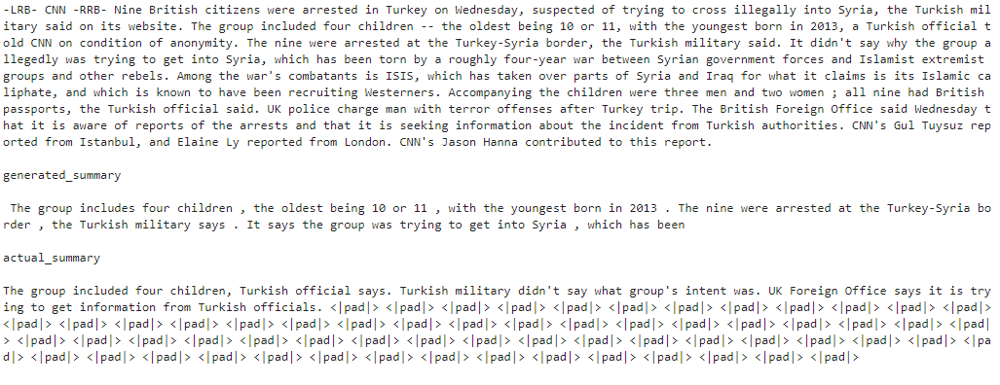
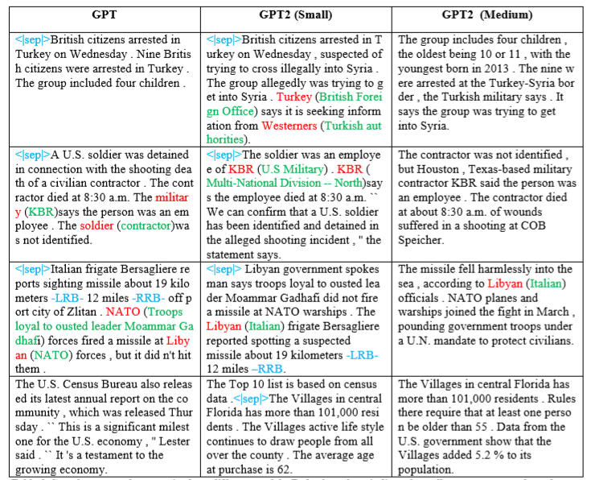

## Introduction
When you want machine learning to convey the meaning of a text, it can do one of two things: rephrase the information, or just show you the most important parts of the content. The first approach is called abstractive summarization, while the second is called extractive summarization. Neither task is easy, and both have their own limitations even in the current state of the art. Extractive summarization often fails to organize sentences in a natural way, so that the readability of created summaries is not acceptable and many times not even conveying the gist of the content. Meanwhile, current state-of-the-art deep learning models like [GPT-3](https://arxiv.org/abs/2005.14165), [GPT-2](https://openai.com/blog/better-language-models/), [BERT](https://ai.googleblog.com/2018/11/open-sourcing-bert-state-of-art-pre.html), etc. help us to generate paraphrased human-like summaries in terms of readability, but their correctness is often questionable. Here we'll focus on achieving acceptable results with the latter approach.

The [Seq2Seq](https://google.github.io/seq2seq/) architecture with RNNs or Transformers is quite popular for difficult natural language processing tasks, like machine translation or text summarization. Many improvements have also been made on the Seq2Seq architecture, like [attention](https://arxiv.org/abs/1409.0473) (to select more relevant content), the copy and coverage mechanism (to copy less frequent tokens and discourage repetition), etc. Here we will be fine-tuning a pre-trained GPT/GPT-2 network on the [CNN/Daily Mail](https://github.com/abisee/cnn-dailymail) dataset, using the standard language model objective, to leverage the powerful text generation capability of such models.

## Dataset Preparation
I have used the non-anonymized CNN/Daily Mail dataset provided by See et al.[2] which is geared for summarization of news articles into 2-3 sentences. A cleaned and tokenized version can be found [here](https://github.com/JafferWilson/Process-Data-of-CNN-DailyMail) [3]. In order to feed this data to the GPT/GPT-2 model, I performed a few more pre-processing steps specific to the GPT models.

Since GPT models have a restriction on the context size (512 and 1024 tokens for GPT and GPT-2, respectively), I only chose those files which had a maximum 512 and 1024 tokens after tokenizing using the GPT tokenizer. Figure 1 shows the distribution of file sizes (total number of words) for both the CNN and Daily Mail datasets. For training, I only chose 1500 files with a relevant number of tokens from each of the CNN and Daily Mail datasets.

To make this a more computationally-efficient experiment, I did not train the model on the complete dataset. In order to speed up the data loading process, I saved tokenized articles and summaries in .json files with the attributes “id”, “article”, and “abstract” for training. One can find the script to create .json files and NumPy matrix of the data [here](https://github.com/SKRohit/Generating_Text_Summary_With_GPT2/blob/master/prepare_data.py) and [here](https://github.com/SKRohit/Generating_Text_Summary_With_GPT2/blob/master/prepare_np_data.py), respectively.


_Distribution of CNN file sizes_


_Distribution of Daily Mail file sizes_

Here is my `Dataset` class which loads training examples from the .json files:

```python
class GPT21024Dataset(Dataset):

    def __init__(self, root_dir, ids_file, mode='train',length=None):
        self.root_dir = root_dir
        self.tokenizer = add_special_tokens()
        with open(ids_file,'r') as f:
            if mode=='train':
                self.idxs = json.load(f)['train_ids']
            elif mode=='valid':
                self.idxs = json.load(f)['valid_ids']
            else:
                self.idxs = json.load(f)['test_ids']
        if len == None:
            self.len = len(self.idxs)
        else:
            self.len = length

    def __len__(self):
        return self.len

    def __getitem__(self,idx):
        idx = self.idxs[idx]
        file_name = os.path.join(self.root_dir,str(idx)+".json")
        with open(file_name,'r') as f:
              data = json.load(f)
        text = self.tokenizer.encode(self.tokenizer.pad_token)*1024
        content = data['article'] + self.tokenizer.encode(self.tokenizer.sep_token) + data['abstract']
        text[:len(content)] = content
        text = torch.tensor(text)
        sample = {'article': text, 'sum_idx': len(data['article'])}
        return sample
```

## Methods
Before delving into the fine-tuning details, let us first understand the basic idea behind language models in general, and specifically GPT-style language models.

A language model is a probabilistic model that predicts the next token in a sequence given the tokens that precede it. It learns the probability of the occurrence of a sentence, or sequence of tokens, based on the examples of text it has seen during training. It can be represented by the following conditional probability:


_[source](https://dl.acm.org/doi/10.5555/944919.944966)_


_[source](https://dl.acm.org/doi/10.5555/944919.944966)_

GPT/GPT-2 is a variant of the Transformer model which only has the decoder part of the Transformer network. It uses multi-headed masked self-attention, which allows it to look at only the first i tokens at time step t, and enables them to work like traditional uni-directional language models. However, instead of processing tokens sequentially like RNNs, these models [process tokens in parallel](https://jalammar.github.io/illustrated-gpt2/), i.e. by predicting tokens for all time steps at once. Such models can be represented by:


_[source](https://s3-us-west-2.amazonaws.com/openai-assets/research-covers/language-unsupervised/language_understanding_paper.pdf)_


_[source](https://s3-us-west-2.amazonaws.com/openai-assets/research-covers/language-unsupervised/language_understanding_paper.pdf)_


_[source](https://s3-us-west-2.amazonaws.com/openai-assets/research-covers/language-unsupervised/language_understanding_paper.pdf)_

## Fine-tuning Details
I have used the Hugging Face Transformer library [4] for the implementation of GPT-2 because of their super simple APIs that help one to focus on other aspects of model training, like hyper-parameter optimization, etc. This proved to be more rewarding in many fine-tuning tasks. Let us first load all the dependencies:

```python
import argparse
from datetime import datetime
import json
import os
import pickle
import random
import sys
import time

import numpy as np
from pytorch_transformers import GPT2Tokenizer
import torch
from torch.nn import CrossEntropyLoss
import torch.nn.functional as F
from torch.utils.data import DataLoader, RandomSampler, SequentialSampler
from tqdm import tnrange, tqdm
from pytorch_transformers import ConstantLRSchedule, GPT2Config, GPT2LMHeadModel,AdamW, GPT2Tokenizer, WarmupLinearSchedule
from tensorboardX import SummaryWriter

from dataset import GPT21024Dataset 
from utils import add_special_tokens, beam_search, generate_beam_sample, generate_sample, sample_seq, set_seed, top_k_top_p_filtering
```

While training I concatenated sources (summaries) and targets (articles) in training examples with a separator token (`<|sep|>`), a delimiter in between, padded with the padding token (`<|pad|>`), and another delimiter, up to a context size of 512 and 1024 for GPT and GPT-2, respectively . This approach of adding a delimiter has been explored in the GPT paper for different NLP tasks, like textual entailment, etc. New delimiter or special tokens can be added to the GPT tokenizer using its `add_special_tokens` method:

```python
def add_special_tokens():
	""" Returns GPT2 tokenizer after adding separator and padding tokens """
	tokenizer = GPT2Tokenizer.from_pretrained('gpt2')
	special_tokens = {'pad_token':'<|pad|>','sep_token':'<|sep|>'}
	num_add_toks = tokenizer.add_special_tokens(special_tokens)
	return tokenizer
```

Like Seq2Seq models, I also considered cross-entropy loss over target (summary) sequences because considering cross-entropy loss over both source (article) and target sequences did not change the performance. I ignored loss over padding tokens, which improved the quality of the generated summaries. I experimented with layer-wise unfreezing after every 15 steps, instead of fine-tuning all the weights at once. Training and validation loss decreased due to layer-wise unfreezing, in comparison to complete fine-tuning, but the quality of generated summaries was not conclusively better, perhaps due to overfitting. I also found that both GPT and GPT-2 were overfitting if trained for more than 5 epochs on only 3000 examples (article-summary pair). I noticed that the bigger the model, the better the quality of generated summaries. GPT-2 345M was generating the best summaries. You can find a few sample generated summaries below.

I also experimented with different hyperparameters like learning rate, learning rate scheduler, optimizer, number of epochs, `gradient_accumulation_steps`, `max_grad_norm`, etc. and found that using a learning rate of 5e-5, Linear Warmup Scheduler with 200 warmup steps, AdamW optimizer, total 5 epochs (more than 5 resulted in overfitting), `gradient_accumulation_steps` of 32 and `max_grad_norm` of 1 seems to be the best for both GPT and GPT-2 models. But, in my opinion, a more thorough analysis of hyperparameter optimization can still be done, and the training dataset size can be increased to improve the model. Below is my `train` function, and you can find the complete training script [here](https://github.com/SKRohit/Generating_Text_Summary_With_GPT2/blob/master/train_gpt2_summarizer.py):

```python
def train(args, model, tokenizer, train_dataset, valid_dataset, ignore_index):
	""" Trains GPT2 model and logs necessary details.
		Args:
			args: dict that contains all the necessary information passed by user while training
 			model: finetuned gpt/gpt2 model
			tokenizer: GPT/GPT2 tokenizer
			train_dataset: GPT21024Dataset object for training data
			ignore_index: token not considered in loss calculation
	"""
    writer = SummaryWriter('./logs')
    train_sampler = RandomSampler(train_dataset)
    train_dl = DataLoader(train_dataset,sampler=train_sampler,batch_size=args.batch_size,num_workers=args.num_workers)
    loss_fct = CrossEntropyLoss(ignore_index=ignore_index) #ignores padding token for loss calculation
    optimizer = AdamW(model.parameters(),lr=args.lr)
    scheduler = WarmupLinearSchedule(optimizer,100,80000)

    global_step = 0
    tr_loss, logging_loss = 0.0, 0.0
    model.zero_grad()
    train_iterator = tnrange(int(args.num_train_epochs), desc="Epoch")
    set_seed(args)
    for _ in train_iterator:
        epoch_iterator = tqdm(train_dl, desc="Training")
        for step, batch in enumerate(epoch_iterator):
            inputs, labels = torch.tensor(batch['article']), torch.tensor(batch['article'])
            inputs = inputs.to(args.device)
            labels = labels.to(args.device)
            model.train()
            logits = model(inputs)[0]
            idx = batch['sum_idx'].item() # index of separator token
            # only consider loss on reference summary just like seq2seq models
            shift_logits = logits[..., idx:-1, :].contiguous()
            shift_labels = labels[..., idx+1:].contiguous()
            loss = loss_fct(shift_logits.view(-1, shift_logits.size(-1)), shift_labels.view(-1))
            loss = loss/args.gradient_accumulation_steps
            loss.backward()
            torch.nn.utils.clip_grad_norm_(model.parameters(), args.max_grad_norm)
            tr_loss += loss.item()
            if (step + 1) % args.gradient_accumulation_steps == 0:
                optimizer.step()
                scheduler.step()  # Update learning rate schedule
                model.zero_grad()
                global_step += 1
                writer.add_scalar('lr', scheduler.get_lr()[0], global_step)
                writer.add_scalar('loss', (tr_loss - logging_loss)/args.gradient_accumulation_steps, global_step)
                logging_loss = tr_loss
                print("loss:", loss.item(), end='\n\n')
                if (step + 1)/args.gradient_accumulation_steps == 1.0:
                	print('After 1st update: ', end='\n\n')
                	generate_sample(valid_dataset, tokenizer, num=2, eval_step=False)
                
                
            if (step + 1) % (10*args.gradient_accumulation_steps) == 0:
                results = evaluate(args, model, valid_dataset, ignore_index, global_step)
                for key, value in results.items():
                    writer.add_scalar('eval_{}'.format(key), value, global_step)
                print('After', global_step+1,'updates: ', end='\n\n')
                generate_sample(valid_dataset, tokenizer, num=2, eval_step=True)
                   
```

Most of the code in the above `train` function is self-explanatory. One thing I want to point out is that since GPT/GPT-2 is huge, I was only able to accommodate a batch size of 1 or 2 (depending on the model size) on a 16GB Nvidia V100. So, to increase the batch size, I used the idea of [accumulating gradients](https://medium.com/huggingface/training-larger-batches-practical-tips-on-1-gpu-multi-gpu-distributed-setups-ec88c3e51255) for n number of steps before updating the weights, where n will be our batch size.

While generating summaries, I tried [nucleus sampling](https://arxiv.org/abs/1904.09751) and beam search with different `top_k`, `top_p`, temperature and beamwidth values respectively, and found that `top_k = 10`, `top_p= 0.5`, and `temperature = 0.8` produced decent summaries for nucleus sampling while a beamwidth of 3 works fine for beam search. Below is the code to generate sample summaries of a given length using nucleus sampling, where the `top_k_top_p_filtering` function performs nucleus filtering.

```python
def top_k_top_p_filtering(logits, top_k=0, top_p=0.0, filter_value=-float('Inf')):
    """ Filter a distribution of logits using top-k and/or nucleus (top-p) filtering
        Args:
            logits: logits distribution shape (vocabulary size)
            top_k > 0: keep only top k tokens with highest probability (top-k filtering).
            top_p > 0.0: keep the top tokens with cumulative probability >= top_p (nucleus filtering).
                Nucleus filtering is described in Holtzman et al. (https://arxiv.org/abs/1904.09751)
        From: https://gist.github.com/thomwolf/1a5a29f6962089e871b94cbd09daf317
    """
    assert logits.dim() == 1  # batch size 1 for now - could be updated for more but the code would be less clear
    top_k = min(top_k, logits.size(-1))  # Safety check
    if top_k > 0:
        # Remove all tokens with a probability less than the last token of the top-k
        indices_to_remove = logits < torch.topk(logits, top_k)[0][..., -1, None]
        logits[indices_to_remove] = filter_value

    if top_p > 0.0:
        sorted_logits, sorted_indices = torch.sort(logits, descending=True)
        cumulative_probs = torch.cumsum(F.softmax(sorted_logits, dim=-1), dim=-1)

        # Remove tokens with cumulative probability above the threshold
        sorted_indices_to_remove = cumulative_probs > top_p
        # Shift the indices to the right to keep also the first token above the threshold
        sorted_indices_to_remove[..., 1:] = sorted_indices_to_remove[..., :-1].clone()
        sorted_indices_to_remove[..., 0] = 0

        indices_to_remove = sorted_indices[sorted_indices_to_remove]
        logits[indices_to_remove] = filter_value
    return logits


def sample_seq(model, context, length, device, temperature=1, top_k=0, top_p=0.0):
	""" Generates a sequence of tokens 
		Args:
			model: gpt/gpt2 model
			context: tokenized text using gpt/gpt2 tokenizer
			length: length of generated sequence.
			device: torch.device object.
			temperature >0: used to control the randomness of predictions by scaling the logits before applying softmax.
			top_k > 0: keep only top k tokens with highest probability (top-k filtering).
			top_p > 0.0: keep the top tokens with cumulative probability >= top_p (nucleus filtering).
	"""
    context = torch.tensor(context, dtype=torch.long, device=device)
    context = context.unsqueeze(0)
    generated = context
    with torch.no_grad():  
        for _ in tnrange(length):
            inputs = {'input_ids': generated}
            outputs = model(**inputs)  # Note: we could also use 'past' with GPT-2/Transfo-XL/XLNet (cached hidden-states)
            next_token_logits = outputs[0][0, -1, :] / temperature
            filtered_logits = top_k_top_p_filtering(next_token_logits, top_k=top_k, top_p=top_p)
            next_token = torch.multinomial(F.softmax(filtered_logits, dim=-1), num_samples=1)
            generated = torch.cat((generated, next_token.unsqueeze(0)), dim=1)
    return generated
```


_sample generated summary 1_


_sample generated summary 2_


_sample generated summary 3_

## Limitations
Before applying this technique to real-world use cases, one must be aware of the limitations of this approach as well as abstractive summarization models in general. Abstractive summarization techniques commonly face issues with generating factually incorrect summaries, or summaries which are syntactically correct but do not make any sense. For example:

> Iran won the world cup after a nuclear deal with the United States. The deal promises to end Iran’s international isolation under years of crippling sanctions.
{: .prompt-info }

In recent research published by [OpenAI](https://openai.com/blog/fine-tuning-gpt-2/) and [Salesforce](https://arxiv.org/abs/1908.08960) (independently), they found that summaries generated on the CNN/Daily Mail dataset were at most only 70% of the time correct, independent of the model used. A recent work from [Stanford and the University of Florida](https://arxiv.org/abs/1911.02541), however, suggested a remedy by fact-checking the generated summaries against reference summaries using reinforcement learning. However, such approaches are still limited to only a few particular types of datasets.

## Results
After training on 3000 training data points for just 5 epochs (which can be completed in under 90 minutes on an Nvidia V100), this proved a fast and effective approach for using GPT-2 for text summarization on small datasets. Improvement in the quality of the generated summary can be seen easily as the model size increases. Also, factual inaccuracy and abstractiveness of the summaries decreases with large models, which might have been happening because of the increased memory abilities of larger models. The generated summaries indicate that the fine-tuned models are trying to exploit the “[Inverted Pyramid](https://www.aclweb.org/anthology/D19-1051)” structure implicitly, like other text summarization models. Also, I noticed that the abstractiveness of summaries was worse after 5 epochs, for GPT-2 (345 M) this may be due to overfitting. In Figure 2 below I show a comparison between the factual accuracy of summaries generated by different GPT models.


_Sample generated summaries from different models. Red color tokens indicate generated words or phrases which were factually incorrect. Green color words or phrases are appropriately copied replacements, and blue color tokens indicate unwanted generated tokens._

### References
1. [Sample Efficient Text Summarization Using a Single Pre-Trained Transformer](https://arxiv.org/abs/1905.08836)
2. [CNN-Daily Mail Dataset Preparation](https://github.com/abisee/cnn-dailymail)
3. [Tokenized CNN-Daily Mail Dataset](https://github.com/JafferWilson/Process-Data-of-CNN-DailyMail)
4. [Hugging Face Transformers](https://github.com/huggingface/transformers)