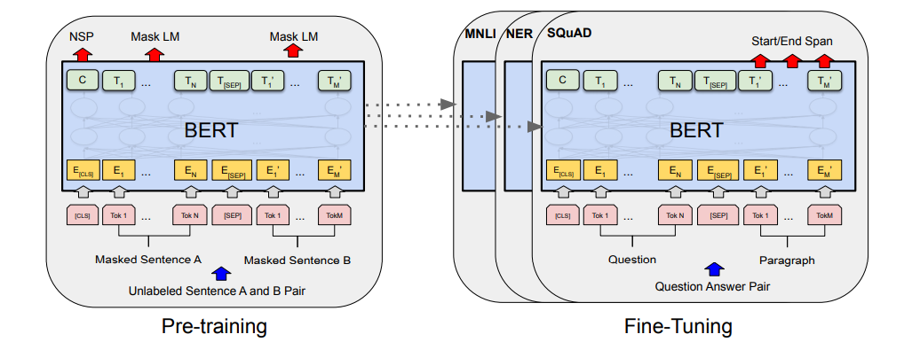
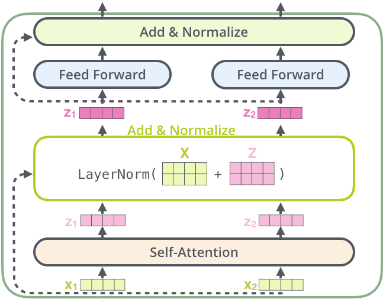
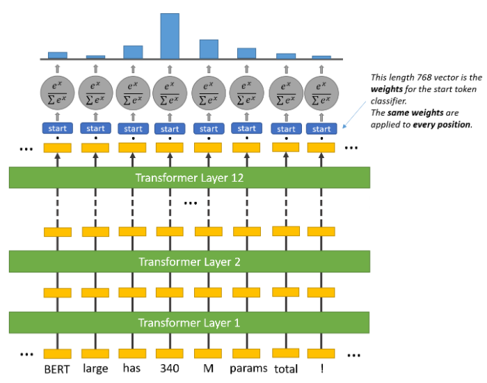
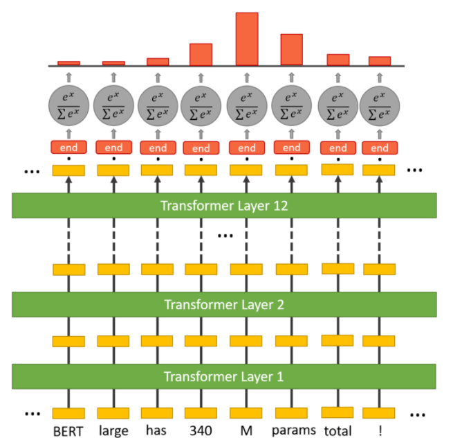

## Introduction
Question-Answering Models are machine or deep learning models that can answer questions given some context, and sometimes without any context (e.g. open-domain QA). They can extract answer phrases from paragraphs, paraphrase the answer generatively, or choose one option out of a list of given options, and so on. It all depends on the dataset it was trained on (e.g. [SQuAD](https://rajpurkar.github.io/SQuAD-explorer/), [CoQA](https://stanfordnlp.github.io/coqa/), etc.) or the problem it was trained for, or to some extent the neural network architecture. So, for example, if you feed this paragraph (context) to your model trained to extract answer phrases from context, and ask a question like “What is a question-answering model?”, it should output the first line of this paragraph.

Such models need to understand the structure of the language, have a semantic understanding of the context and the questions, have an ability to locate the position of an answer phrase, and much more. So without any doubt, it is difficult to train models that perform these tasks. Fortunately, the concept of attention in neural networks has been a lifesaver for such difficult tasks. Since [its introduction](https://lilianweng.github.io/lil-log/2018/06/24/attention-attention.html#a-family-of-attention-mechanisms) for sequence modeling tasks, lots of RNN networks with sophisticated attention mechanisms like [R-NET](https://www.microsoft.com/en-us/research/wp-content/uploads/2017/05/r-net.pdf), [FusionNet](https://arxiv.org/pdf/1711.07341.pdf), etc. have shown great improvement in QA tasks. However, a completely new neural network architecture based on attention, specifically self-attention, called [Transformer](https://ai.googleblog.com/2017/08/transformer-novel-neural-network.html), has been the real game-changer in NLP. Here I will discuss one such variant of the Transformer architecture called BERT, with a brief overview of its architecture, how it performs a question answering task, and then write our code to train such a model to answer COVID-19 related questions from research papers.

## Pre-Requisite
- **Basic Knowledge of NLP**: Familiarity with Natural Language Processing concepts, including tokenization, embeddings, and transformers.
- **Python Programming**: Understanding of Python, including libraries such as NumPy, pandas, and scikit-learn.
- **Machine Learning Fundamentals**: Knowledge of machine learning basics, including model training, evaluation, and hyperparameter tuning.
- **Experience with PyTorch or TensorFlow**: Basic understanding of deep learning frameworks like PyTorch or TensorFlow, as BERT models are typically implemented in these.
- **Understanding of BERT**: Awareness of the BERT (Bidirectional Encoder Representations from Transformers) architecture, including its use of attention mechanisms and pre-training/fine-tuning processes.
- **Access to Data and Compute Resources**: A dataset suitable for question-answering tasks (like SQuAD) and access to GPU resources for efficient training.

## Language Models And Transformers
Before jumping to BERT, let us understand what language models are and how Transformers come into the picture.

A language model is a probabilistic model that learns the probability of the occurrence of a sentence, or sequence of tokens, based on the examples of text it has seen during training. For example:
```
P(That which does not kill us make us stronger) = P(That)P(which|That)P(does|That,which)P(not|That,which,does)…

P(That which does not kill us make us stronger) = 0.65
```

These language models, if big enough and trained on a sufficiently large dataset, can start understanding any language and its intricacies really well. Traditionally RNNs were used to train such models due to the sequential structure of language, but they are slow to train (due to sequential processing of each token) and sometimes difficult to converge (due to vanishing/exploding gradients).

However, different variants of Transformers, with their ability to process tokens in parallel and impressive performance due to self-attention mechanism and different pre-training objectives, have made training large models (and sometimes [really really large models](https://arxiv.org/abs/2005.14165)), which understand natural language really well, possible. Different Transformer-based language models, with small changes in their architecture and pre-training objective, perform differently on different types of tasks. [BERT](https://ai.googleblog.com/2018/11/open-sourcing-bert-state-of-art-pre.html) (Bidirectional Encoder Representations from Transformers) is one such model. BERT has been trained using the Transformer Encoder architecture, with Masked Language Modelling (MLM) and the Next Sentence Prediction (NSP) pre-training objective.

## BERT And Its Variants

_BERT Architecture [source](https://arxiv.org/pdf/1810.04805.pdf)_

Now that we know what BERT is, let us go through its architecture and pre-training objectives briefly. BERT uses Transformer Encoder from the original [Transformer paper](https://arxiv.org/abs/1706.03762). An Encoder has a stack of encoder blocks (where the output of one block is fed as the input to the next block), and each encoder block is composed of two neural network layers. First there is a self-attention layer (which is the magic operation that makes transformers so powerful) and then a simple feed-forward layer. After each layer, there is a residual connection and a layer normalization operation as shown in the figure below.


_One Encoder Block ([source](https://jalammar.github.io/illustrated-transformer/)). Here X1, X2 are input vectors. One vector for each token._

So, for each encoder layer, the number (with a maximum limit of 512) of input vectors and output vectors is always the same. And before the first encoder layer, the input vector for each token is obtained by adding token embedding, positional embedding, and segment embedding. These vectors are processed in parallel inside each encoder layer using matrix multiplications, and the obtained output vectors are fed to the next encoder block. After being processed sequentially through N such blocks, the obtained output vectors start understanding natural language very well.

This is a very compressed overview of the BERT architecture, focusing only on the ideas we need to understand the rest of the blog. For a more elaborate discussion on how different operations happen in each layer, multi-head self-attention, and understanding parallel token processing, please check out [Jay Alammar’s Blog](https://jalammar.github.io/illustrated-transformer/).

### Pre-Training Objective
A pre-training objective is a task on which a model is trained before being fine-tuned for the end task. GPT models are trained on a Generative Pre-Training task (hence the name GPT) i.e. generating the next token given previous tokens, before being fine-tuned on, say, SST-2 (sentence classification data) to classify sentences.

Similarly, BERT uses MLM and NSP as its pre-training objectives. It uses a few special tokens like CLS, SEP, and MASK to complete these objectives. We will see the use of these tokens as we go through the pre-training objectives. But before proceeding, we should know that each tokenized sample fed to BERT is appended with a CLS token in the beginning and the output vector of CLS from BERT is used for different classification tasks. Now let’s start with MLM.

In the MLM objective, a percentage of tokens are masked i.e. replaced with special token MASK, and the model is asked to predict the correct token in place of MASK. To accomplish this a masked language model head is added over the final encoder block, which calculates a probability distribution over the vocabulary only for the output vectors (output from the final encoder block) of MASK tokens. And in NSP, the two sentences tokenized and the SEP token appended at their end are concatenated and fed to BERT. The output vector of the CLS token is then used to calculate the probability of whether the second sentence in the pair is the subsequent sentence in the original document. For both the objectives, standard cross-entropy loss with AdamW optimizer is used to train the weights.

The above pre-training objectives are really powerful in capturing the semantics of the natural language in comparison to other pre-training objectives, e.g. the generative pre-training objective. Hence, many models with similar or slightly tweaked pre-training objectives, with more or less the same architecture as BERT, have been trained to achieve SOTA results on many NLP tasks. [RoBERTA](https://arxiv.org/abs/1907.11692), [SpanBERT](https://www.cs.princeton.edu/~danqic/papers/tacl2020.pdf), [DistilBERT](https://arxiv.org/abs/1910.01108), [ALBERT](https://arxiv.org/abs/1909.11942) etc. are a few of them.

After being trained on such pre-training objectives, these models are fine-tuned on special tasks like question answering, name entity recognition, etc. Here we will see how BERT is trained on a Question-Answering objective.

## Question Answering Objective
#### Dataset
As mentioned before, the QA task can be framed in different ways. Here I will be focusing on context-based question answering, where questions are asked from a given paragraph. SQuAD is a popular dataset for this task which contains many paragraphs of text, different questions related to the paragraphs, their answers, and the start index of answers in the paragraph. There are two versions of SQuAD, SQuAD1.1 and SQuAD2.0, with the main difference being that SQuAD2.0 contains over 50,000 unanswerable questions that look similar to the answerable ones. So to do well on SQuAD2.0, systems must not only answer questions when possible, but also determine when no answer is supported by the paragraph and abstain from answering. Both datasets are publicly available and can be downloaded from [here](https://rajpurkar.github.io/SQuAD-explorer/). Here, I will be using SQuAD2.0.

#### BERT SQuAD Architecture
To perform the QA task we add a new question-answering head on top of BERT, just the way we added a masked language model head for performing the MLM task. The purpose of this question-answering head is to find the start token and end token of an answer for a given paragraph, for example:
```markdown
Paragraph: BERT-large is really big … it has 24 layers and an embedding size of 1024 for a total of 340M parameters! Altogether it is 1.34GB, so expect it to take a couple of minutes to download.

Question: How many parameters does BERT-large have?
Answer: 340M parameters
Start token: 340
End token: parameters
```
Everything that comes in between, including the start and end token, is considered an answer.

Inside the question answering head are two sets of weights, one for the start token and another for the end token, which have the same dimensions as the output embeddings. The output embeddings of all the tokens are fed to this head, and a dot product is calculated between them and the set of weights for the start and end token, separately. In other words, the dot product between the start token weight and output embeddings is taken, and the dot product between the end token weight and output embeddings is also taken. Then a softmax activation is applied to produce a probability distribution over all the tokens for the start and end token set (each set also separately). The tokens with the maximum probability are chosen as the start and end token, respectively. In this process, it may so happen that the end token could appear before the start token. In that case an empty string is output as the predicted answer. The figures below should make the operations clearer.


_Question Answering Head Separately for Start Token ([source](https://mccormickml.com/2020/03/10/question-answering-with-a-fine-tuned-BERT/#part-1-how-bert-is-applied-to-question-answering))_


_Question Answering Head Separately for End Token ([source](https://mccormickml.com/2020/03/10/question-answering-with-a-fine-tuned-BERT/#part-1-how-bert-is-applied-to-question-answering))_

In popular implementations, this head is implemented as a feed-forward layer that takes the input of the same dimension as the BERT output embeddings and returns a two-dimensional vector, which is then fed to the softmax layer. The complete BERT SQuAD model is finetuned using cross-entropy loss for the start and end tokens.

## Training a Question-Answering Model
We will be using Hugging Face’s [Transformers](https://github.com/huggingface/transformers/) library for training our QA model. We will also be using BioBERT, which is a language model based on BERT, with the only difference being that it has been finetuned with MLM and NSP objectives on different combinations of general & biomedical domain corpora. Different domains have specific jargons and terms which occur very rarely in standard English, and if they occur it could mean different things, or imply different contexts. Hence, models like BioBERT, LegalBERT, etc. have been trained to learn such nuances of the domain-specific text so that domain-specific NLP tasks could be performed with better accuracy.

Here we aim to use the QA model to extract relevant information from COVID-19 research literature. Hence, we will be finetuning BioBERT using Hugging Face’s Transformers library on SQuADv2 data.

In the examples section of the Transformers repository, Hugging Face has already provided a script, `run_squad.py`, to train the QA model on SQuAD data. This script can be run easily using the below command.

```python
python run_squad.py \
--model_type bert \  
--model_name_or_path monologg/biobert_v1.1_pubmed \  
--do_train \  
--do_eval \  
--train_file train-v2.0.json \  
--predict_file dev-v2.0.json \  
--per_gpu_train_batch_size 24 \ 
--per_gpu_eval_batch_size 24 \ 
--learning_rate 3e-5 \  
--num_train_epochs 4 \  
--max_seq_length 384 \ 
--doc_stride 128 \  
--save_steps 1500 \  
--output_dir ./biobert \  
--overwrite_output_dir \  
--thread 32 \
```

One can understand most of the parameters from their names. For more details on the parameters and an exhaustive list of parameters that can be adjusted, one can refer to the github repo for the code [examples](https://github.com/huggingface/transformers/tree/main/examples).

Using this script, the model can be easily finetuned to perform the QA task. However, running this script is RAM heavy, because `squad_convert_examples_to_features` tries to process the complete SQuAD data at once and requires more than 12GB of RAM. So, I have modified `load_and_cache_examples` and added a new function named `read_saved_data` which can process SQuAD data in batches. You can check out these methods below.

_load_and_cache_examples_:
```python
def load_and_cache_examples(args, tokenizer, evaluate=False, output_examples=False):
    if args.local_rank not in [-1, 0] and not evaluate:
        # Make sure only the first process in distributed training process the dataset, and the others will use the cache
        torch.distributed.barrier()

    # Load data features from cache or dataset file
    input_dir = args.data_dir if args.data_dir else "."
    cached_features_file = os.path.join(
        input_dir,
        "cached_{}_{}_{}".format(
            "dev" if evaluate else "train",
            list(filter(None, args.model_name_or_path.split("/"))).pop(),
            str(args.max_seq_length),
        ),
    )
    root_dir = os.path.join(cached_features_file+"_dir")
    features_file = os.path.join(root_dir,'features')
    datasets_file = os.path.join(root_dir,'datasets')
    examples_file = os.path.join(root_dir,'examples')

    # Init features and dataset from cache if it exists
    if os.path.exists(cached_features_file) and not args.overwrite_cache:
        logger.info("Loading features from cached file %s", cached_features_file)
        features_and_dataset = torch.load(cached_features_file)
        features, dataset, examples = (
            features_and_dataset["features"],
            features_and_dataset["dataset"],
            features_and_dataset["examples"],
        )
        if output_examples:
            return features, dataset, examples
        else:
            return dataset
    elif os.path.exists(datasets_file) and not output_examples and not args.overwrite_cache:
        pass
    elif os.path.exists(datasets_file) and os.path.exists(features_file) and os.path.exists(examples_file) and output_examples and not args.overwrite_cache:
        pass
    else:
        logger.info("Creating features from dataset file at %s", input_dir)

        if not args.data_dir and ((evaluate and not args.predict_file) or (not evaluate and not args.train_file)):
            try:
                import tensorflow_datasets as tfds
            except ImportError:
                raise ImportError("If not data_dir is specified, tensorflow_datasets needs to be installed.")

            if args.version_2_with_negative:
                logger.warn("tensorflow_datasets does not handle version 2 of SQuAD.")

            tfds_examples = tfds.load("squad")
            examples = SquadV1Processor().get_examples_from_dataset(tfds_examples, evaluate=evaluate)
        else:
            processor = SquadV2Processor() if args.version_2_with_negative else SquadV1Processor()
            if evaluate:
                examples = processor.get_dev_examples(args.data_dir, filename=args.predict_file)
            else:
                examples = processor.get_train_examples(args.data_dir, filename=args.train_file)

        for i,j in enumerate(range(0,len(examples),args.data_process_batch)):
            sub_examples = examples[j:j+args.data_process_batch]
            features, dataset = squad_convert_examples_to_features(
                examples=sub_examples,
                tokenizer=tokenizer,
                max_seq_length=args.max_seq_length,
                doc_stride=args.doc_stride,
                max_query_length=args.max_query_length,
                is_training=not evaluate,
                return_dataset="pt",
                threads=args.threads,
            )

            if args.local_rank in [-1, 0]:
                if not os.path.exists(os.path.join(features_file)):
                    os.makedirs(os.path.join(features_file))
                if not os.path.exists(os.path.join(datasets_file)):
                    os.makedirs(os.path.join(datasets_file))
                if not os.path.exists(os.path.join(examples_file)):
                    os.makedirs(os.path.join(examples_file))

                logger.info("Saving features into cached files %s, %s, %s", os.path.join(features_file,'features_'+str(i)),os.path.join(datasets_file,'datasets_'+str(i)),os.path.join(examples_file,'examples_'+str(i)))
                torch.save({"features": features}, os.path.join(features_file,'features_'+str(i)))
                torch.save({"datasets": dataset}, os.path.join(datasets_file,'datasets_'+str(i)))
                torch.save({"examples": sub_examples}, os.path.join(examples_file,'examples_'+str(i)))

    if args.local_rank == 0 and not evaluate:
        # Make sure only the first process in distributed training process the dataset, and the others will use the cache
        torch.distributed.barrier()
    return read_saved_data(root_dir,evaluate=evaluate,output_examples=output_examples)
```
_read_saved_data_:
```python
def read_saved_data(input_dir,evaluate=False,output_examples=False):
    from torch.utils.data import TensorDataset

    if output_examples:
        feat="features;datasets;examples"
    else:
        feat="datasets"

    all_features = {"features":[],"examples":[],"datasets":[]}
    all_input_ids = torch.tensor([], dtype=torch.long)
    all_attention_masks = torch.tensor([], dtype=torch.long)
    all_token_type_ids = torch.tensor([], dtype=torch.long)
    all_cls_index = torch.tensor([], dtype=torch.long)
    all_p_mask = torch.tensor([], dtype=torch.float)
    all_is_impossible = torch.tensor([], dtype=torch.float)
    all_start_positions = torch.tensor([], dtype=torch.long)
    all_end_positions = torch.tensor([], dtype=torch.long)

    for i in feat.split(";"):
        for file_name in os.listdir(os.path.join(input_dir,i)):
            data = torch.load(os.path.join(input_dir,i,file_name))[i]
            if isinstance(data,TensorDataset):
                if evaluate:
                    all_input_ids = torch.cat([all_input_ids,data.tensors[0]],dim=0)
                    all_attention_masks = torch.cat([all_attention_masks,data.tensors[1]],dim=0)
                    all_token_type_ids = torch.cat([all_token_type_ids,data.tensors[2]],dim=0)
                    all_cls_index = torch.cat([all_cls_index,data.tensors[4]],dim=0)
                    all_p_mask = torch.cat([all_p_mask,data.tensors[5]],dim=0)
                else:
                    all_input_ids = torch.cat([all_input_ids,data.tensors[0]],dim=0)
                    all_attention_masks = torch.cat([all_attention_masks,data.tensors[1]],dim=0)
                    all_token_type_ids = torch.cat([all_token_type_ids,data.tensors[2]],dim=0)
                    all_start_positions = torch.cat([all_start_positions,data.tensors[3]],dim=0)
                    all_end_positions = torch.cat([all_end_positions,data.tensors[4]],dim=0)
                    all_cls_index = torch.cat([all_cls_index,data.tensors[5]],dim=0)
                    all_p_mask = torch.cat([all_p_mask,data.tensors[6]],dim=0)
                    all_is_impossible = torch.cat([all_is_impossible,data.tensors[7]],dim=0)
            elif isinstance(data,list):
                all_features[i] += data
    
    if evaluate and "datasets" in feat.split(";"):
        all_example_index = torch.arange(all_input_ids.size(0), dtype=torch.long)
        all_features["datasets"] = TensorDataset(all_input_ids, all_attention_masks, all_token_type_ids, all_example_index, all_cls_index, all_p_mask)
    elif not evaluate and "datasets" in feat.split(";"):
        all_features["datasets"] = TensorDataset(all_input_ids,all_attention_masks,all_token_type_ids,all_start_positions,all_end_positions,all_cls_index,all_p_mask,all_is_impossible,)


    if output_examples:
        return all_features['datasets'], all_features['examples'], all_features['features']
    else:
        return all_features['datasets']
```
Basically, the added modifications run the same method `squad_convert_examples_to_features` on mini-batches of data and save the created features in a folder. One can define the minibatch size by adding the below line at line 660 in `run_squad.py`, and providing an argument `data_process_batch` in the command I mentioned above.

```python
parser.add_argument(
        "--data_process_batch",
        default=50000,
        type=int,
        help="Number of batches in which SQuAD data will be processed.",
    )
```
The modified `modified_run_squad.py` can be downloaded from [here](https://gist.github.com/SKRohit/04ac2b4805382f72e7591630ee971bda).

## Model Validation
Our trained model was able to achieve an F1 score of 70 and an Exact Match of 67.8 on SQuADv2 data after 4 epochs, using the default hyperparameters mentioned in the `run_squad.py`. Now let us see the performance of this trained model on some research articles from the [COVID-19 Open Research Dataset Challenge (CORD-19)](https://www.kaggle.com/allen-institute-for-ai/CORD-19-research-challenge). Below are examples of some sample texts obtained from research articles, questions asked on the sample text, and the predicted answer.

```markdown
Context:  Conclusion : Our study firstly demonstrated the regional disparity of COVID - 19 in Chongqing municipality and further thoroughly compared the differences between severe and non - severe patients. The 28 - day mortality of COVID - 19 patients from 3 designed hospitals of Chongqing is 1. 5 %, lower than that of Hubei province and mainland China including Hubei province. However, the 28 - mortality of severe patients was relatively high, with much higher when complications occurred. Notably, the 28 - mortality of critically severe patients complicated with severe ARDS is considerably as high as 44. 4 %. Therefore, early diagnosis and intensive care of critically severe COVID - 19 cases, especially those combined with ARDS, will be considerably essential to reduce mortality.
Question: What is the mortality for ARDS? 
Predicted Answer: 44.4 %
```

```markdown
Context:  This is a retrospective study from 3 patients with 2019 - nCoV infection admitted to Renmin Hospital of Wuhan University, a COVID - 2019 designated hospital in Wuhan, from January 31 to February 6, 2020. All patients were diagnosed and classified based on the Diagnosis and Treatment of New Coronavirus Pneumonia ( 6th edition ) published by the National Health Commission of China4. We recorded the epidemiological history, demographic features, clinical characteristics, symptoms and signs, treatment and clinical outcome in detail. Additionally, we found that the proportion of probiotics was significantly reduced, such as Bifidobacterium, Lactobacillus, and Eubacterium, and the proportion of conditioned pathogenic bacteria was significantly increased, such as Corynebacterium of Actinobacteria and Ruthenibacterium of Firmicutes. Notably, all patients died.

>Question:What is the mortality of ARDS caused by viral infections?    
Predicted Answer* all patients died.
```

```markdown
Context: Meanwhile, numbers of patients with COVID - 19 infection had chronic comorbidities, mainly hypertension, diabetes and cardiovascular disease, which is similar to MERS - COV population. Those results indicate that older adult males with chronic underlying disease might be more susceptibility to COVID - 19 or MERS - COV… CC - BY - NC - ND 4. 0 In terms of laboratory testing, reduced lymphocytes and increased CRP were found in both COVID - 19 and MERS - COV patients. This result indicates that COVID - 19 might be associated with cellular immune response, mainly act on lymphocytes like MERS - COV does $[ 48 ]$. The cells infected by viruses induce the release of numbers of pro - inflammatory cytokines and inflammation storm in the body. Moreover, increased cytokines might make damage to related organs such as liver $[ 49 ]$. Our results demonstrated that abnormal value of AST was found in MERS - COV population, but not in COVID - 19 population. The possible reason is that the follow - up time of COVID - 19 population was too short, and the liver.

Question: What kind of cytokines play a major role in host response?  
Predicted Answer:  pro - inflammatory
```

## Conclusion
In this article we briefly went through the architecture of BERT, saw how BERT performs on a question-answering task, trained a version of the BERT model (Bio-BERT) on SQuADv2 data using `modified_run_squad.py` (which reduces the RAM usage), and saw the performance of the trained model on texts from COVID-related research articles. The performance of such models depends to a large extent on the context and relevant question fed to the model. Here, contexts were manually extracted from articles and fed to the model. In later articles we will see a deep learning based approach to find the most appropriate paragraph from research articles, given a specific question.