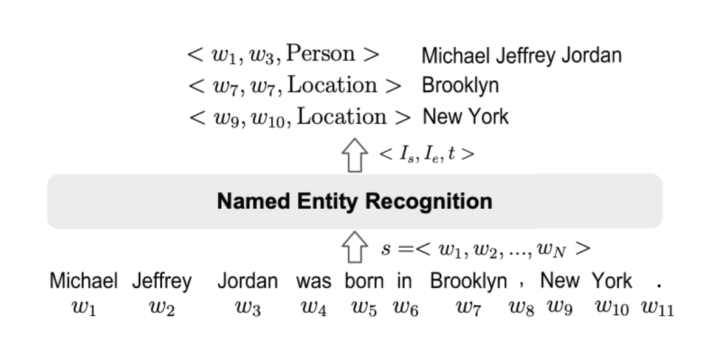
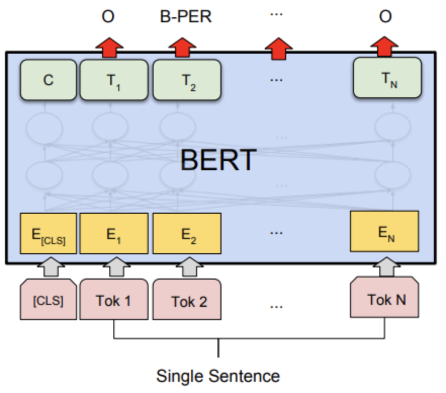
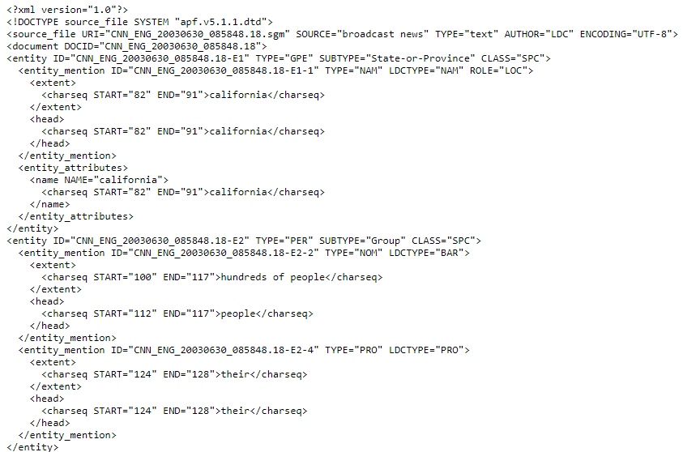

## What is NER?

NER is a part of information extraction task where the goal is to locate and classify named entities from unstrctured text into predefined entity categories e.g. in following text *Ashish Vaswani et.al introduced Transformers architecture in 2017.* *Ashish Vaswani* could be considered a *person entity* belonging to person category and and *2017* could be considered a *date entity* belonging to date category.

Formally, given a sequence of tokens $s={w_1,w_2,...,w_n}$, an NER task is to output a list of tuples ${I_s,I_e,t}$, each of which is a named entity mentioned in $s$. Here, $I_s ∈ [1, N], I_e ∈ [1, N]$ are the start and the end indexes of a named entity mention; $t$ is the entity type from a predefined category set. 



In the above definition, we are assigning a single entity category to an entiy, but in [recent literature](https://www.aclweb.org/anthology/E17-1075.pdf) classifying entities into multiple categories using datesets like [Wiki (Gold)](https://github.com/juand-r/entity-recognition-datasets), [BBN](https://catalog.ldc.upenn.edu/LDC2005T33) etc. is also quite popular and classified as fine-grained NER task.

Another, complex variant of NER task is nested NER tasks, where some entity mentions are embedded in longer entity mentions. e.g. *Bank of Americs* where *Bank of America* and *America* both could be enties. Extracting such entities could be a bit tricky and we will look at few architectures to handle that but let us first see where NER is useful. 

## Why or Where NER is useful?

Extracting named entities from unstructured text could be very useful step for a variety of downstream tasks and in supporting various applications. We will look at few of the tasks and applications below.
- In chatbots extracting entities is very essential to understand the context and provide relevant recommendation/information based on mentioned entity. In [Rasa](https://rasa.com/), a popular chatbot development framework, there is a separate NLU (Natural Language Understanding) pipeline for training an entity detection and intent classification model.
- Semantic text search can be improved by recognizing named entities in search queries which in turn enable search engines to understand the concepts, meaning and intent behind the quries well.
- Categorizing news articles into defined hierarchies using different entities related to 
- Extracted entities could used as features in other downstream tasks like question answering, machine translation etc.

This is not the exhaustive list of use cases of NER but you can understand that usefulness of NER is versatile.

## Performing NER Using Transformers

Deep Learning has revolutionised every field it has been applied into, and same is the case in NER. Current state of the art models in NER are all powered by deep learning architectures. Specifically for NLP tasks transformers based models like [BERT](https://arxiv.org/abs/1810.04805), GPT are making quite a wave these days. Here we will discuss how to frame NER as a Machine Reading Comprehension (MRC) problem using BERT like models.

### NER using BERT like Models
Doing NER with different BERT-like models like RoBERTa, Distill-BERT, AlLBERT etc is very similar. We will see this approach here briefly since already it has been covered in detail [before](https://www.depends-on-the-definition.com/named-entity-recognition-with-bert/).

For NER, a linear classifier is added on top of [BERT](https://arxiv.org/abs/1810.04805) or BERT like models to classify each token into an entity category.


_[source](https://arxiv.org/abs/1810.04805)_

Embedding matrix, $E∈R^{n \times d}$ where $d$ is the vector dimension of the last layer of the model and $n$ is the number of tokens obtained from BERT model is fed to a linear classifier which returns a probability distribution over all the entity categories. And the complete architecture with the classifier head is finetuned on cross-entropy loss. During the validation entity category with maximum probability is assigned to each token.

### Named Entity Recognition as Machine Reading Comprehension

In recent years, we have seen [formalizing NLP problems as question answering tasks](https://arxiv.org/pdf/2011.03023.pdf) has shown very good performance using relatively less data. In the paper [*A Unified MRC Framework for Named Entity Recognition*](https://arxiv.org/pdf/1910.11476v6.pdf) the authors have tried to implement NER as a MRC problem and had been able to achieve very good results, even on nested NER datasets using very litle finetuning of BERT language model. So, let us dig into the model architecture and try to understand the training procedure. 

For question answering problem we concatenate the question *q* and the passage *X* and feed it to BERT, forming the combined string *{[CLS], q1, q2, ..., qm, [SEP], x1, x2, ..., xn}*, where *q1,q2,..,qm* and *x1,x2,..,xm* are tokenized question and passage respectively and *[CLS]* & *[SEP]* are special tokens in BERT. BERT returns us a context representation matrix $E∈R^{n \times d}$ where *d* is the vector dimension of the last layer of BERT and the query representation is simply dropped. Using the matrix $E$ probabibility of each token being start and end indices are calculated respectively applying below operations: 

$P_{start} = softmax_{each row}(E.T_{start})∈R^{n \times 2}$

and 

$P_{end} = softmax_{each row}(E.T_{end})∈R^{n \times 2}$

where $T_{start}$ and $T_{end} ∈ R^{n \times 2}$ are the weights learned during training.  

> NOTE: Though $T_{end}$ or $T_{start} ∈ R^{n \times 2}$ have been mentioned [paper](https://arxiv.org/pdf/1910.11476v6.pdf), in the implementation $T_{end}$ or $T_{start} ∈ R^{n \times 1}$ with sigmoid have been used which is certainly more efficient in terms of compute.
{: .prompt-info }

After above operation applying argmax to each row of $P_start$ and $P_end$ gives us the predicted indexes that might be the starting or ending positions, i.e. $\hat{I}_{start}$ and $\hat{I}_{end}$:

$\hat{I}_{start}$ = $\{i|argmax(P^{i}_{start})=1, i=1,..,n \}$

$\hat{I}_{end}$ = $\{i|argmax(P^{i}_{end})=1, i=1,..,n \}$

where the superscript $i$ denotes the i-th row of a matrix.

In the next step each predicted start index needs to be matched with its corresponding predicted end index. A binary classification model is trained to predict the probability of a pair of start and end indices matching as follows:

$P_{i_{start},j_{end}} = sigmoid(m.concat(E_{i_{start}},E_{j_{end}}))$

where $i_{start}∈$ $\hat{I}_{start}$, $i_{end}∈$ $\hat{I}{end}$, and $m∈R^{1 \times 2}$ are the weights learned during training.

The sum of cross entropy loss (or binary cross entropy loss) on $P_{start}$ & $P_{end}$ and binary cross entropy loss on $P_{i_{start},j_{end}}$ are calculated and gradients are backpropagated to train the complete architecture. In this method more than one entity and even nested entities are extracted easily in comparison to [traditional question answering architecture](https://mccormickml.com/2020/03/10/question-answering-with-a-fine-tuned-BERT/#part-1-how-bert-is-applied-to-question-answering) where only a single span is output given a query and passage pair.

## Datasets

There are many NER datasets including domain specific datasets freely available. we will briefly explain a few of the popular ones which are frequently used in current research papers.
- **CoNLL-2003**: It contains annotations for Reuters news in two languages: English and German. The English dataset has a large portion of sports news with annotations in four entity types (Person, Location, Organization, and Miscellaneous). The complete dataset can be downloaded from [here](https://github.com/synalp/NER/tree/master/corpus/CoNLL-2003).
- **OntoNotes**:  The OntoNotes data is annotated on a large corpus, comprising of various genres (weblogs, news, talk shows, broadcast, usenet newsgroups, and conversational telephone speech) with structural information (syntax and predicate argument structure) and shallow semantics (wordsense linked to an ontology and coreference). There are 5 versions, from Release 1.0 to Release 5.0. The texts are annotated with 18 entity types, consisting of 11 types (Person, Organization, etc) and 7 values (Date, Percent, etc). This dataset can be downloaded from [here](https://catalog.ldc.upenn.edu/LDC2013T19).
- **ACE 2004 and ACE 2005**: The corpus consists of data of various types annotated for entities and relations and was created by Linguistic Data Consortium. The two datasets each contain 7 entity categories. For each entity type, there are annotations for both the
entity mentions and mention heads. These datasets contain about 24% and 22% of the nested mentions. And it can be downloaded from [here](https://cogcomp.github.io/cogcomp-nlp/corpusreaders/doc/ACEReader.html)


*Sample ACE-2003 dataset [source](https://cogcomp.github.io/cogcomp-nlp/corpusreaders/doc/ACEReader.html)*


## Metrics

Following are the most commonly used evaluation metrics for NER systems. There are other complex evaluations metrics also available but they are not intuitive and make error analysis difficult.
- **Precision**: Precision is defined as below 
$Precison=\frac{TP}{TP+FP}$, where
$TP$ = True Positive, i.e.  entities that are recognized by NER and match the ground truth.
$FP$ = False Positive, i.e. entities that are recognized by NER but do not match the ground truth.
Precision measures the ability of a NER system to present only correct entities.
- **Recall**: Recall is defined as below
$Recall=\frac{TP}{TP+FN}$, where
$FN$ = False Negative, i.e. entities annotated in the ground which that are not recognized by NER.
Recall measures the ability of a NER system to recognize all entities in a corpus.
- **F-1 Score**: F-1 score is the harmonic mean of precision and recall. i.e.
$F-1 Score = 2*\frac{Precision*Recall}{Precision+Recall}$
Since most NER systems involve multiple entity types, it is often required to assess the performance across all entity classes. Two measures
are commonly used for this purpose: the macroaveraged F-1 score and the micro-averaged F-1 score. The macro-averaged F-1 score computes the F-1 score independently for each entity type, then takes the average (hence treating all entity types equally). The micro-averaged F-1 score aggregates the contributions of entities from all classes to compute the average (treating all entities equally).


## Train your own NER model

Now let us train our own NER model. We will be using ACE 2004 dataset to train an MRC based model discussed above. So let us look at different steps involved. We will be using this repository as a reference for our implementation and complete code can be found on repo here.

### Data Preparation

ACE 2004 dataset can be downloaded from [here](https://cogcomp.seas.upenn.edu/page/resource_view/60). It is structured in xml format like below and we need to process the data in order to convert it into proper structure to feed to underlying BERT model as a question answering problem. Fortunately the processed version of data which looks like below can be downloaded from [here](https://github.com/ShannonAI/mrc-for-flat-nested-ner/blob/master/ner2mrc/download.md). But if you want to use your own data make sure to convert it into relevant format. A sample code to do so is provided [here](https://github.com/ShannonAI/mrc-for-flat-nested-ner/blob/master/ner2mrc/genia2mrc.py).

### Training

We have already seen the architecture of the model and how it is trained above. So, here we will look at the code and different hyperparameters to start the training process. After cloning the repository 
```
git clone https://github.com/SKRohit/mrc-for-flat-nested-ner
cd mrc-for-flat-nested-ner
pip install -r requirements.txt
```
Then run the below command to start training the Huggingface's 'bert-base-uncased' implementation on ACE-2004 data present in the data directory. One can play around with different parameters as well.
```
python trainer_new.py --data_dir "./data/ace2004" \  
--bert_config_dir "./data" \  
--max_length 128 \  
--batch_size 4 \  
--gpus="1" \  
--precision=16 \  
--progress_bar_refresh_rate 1 \  
--lr 3e-5 \  
--distributed_backend=ddp \  
--val_check_interval 0.5 \  
--accumulate_grad_batches 2 \  
--default_root_dir "./outputs" \  
--mrc_dropout 0.1 \  
--bert_dropout 0.1 \  
--max_epochs 20 \  
--span_loss_candidates "pred_and_gold" \  
--weight_span 0.1 \  
--warmup_steps 0 \  
--max_length 128 \  
--gradient_clip_val 1.0 \  
--model_name 'bert-base-uncased' 
```
In the original repository, pre-trained BERT models by Google were used, which needed to be downloaded and converted into PyTorch models before being used. Hence, here I adapted the code to run any Huggingface's BERT implementation by just providing the model name in model_name parameter in trainer.py.


## References
- [A Unified MRC Framework for Named Entity Recognition](https://arxiv.org/pdf/1910.11476v6.pdf)
- [Question Answering with BERT](https://mccormickml.com/2020/03/10/question-answering-with-a-fine-tuned-BERT/#part-1-how-bert-is-applied-to-question-answering)
- [BERT Paper](https://arxiv.org/abs/1810.04805)
- [Hugging Face Transformers](https://github.com/huggingface/transformers)