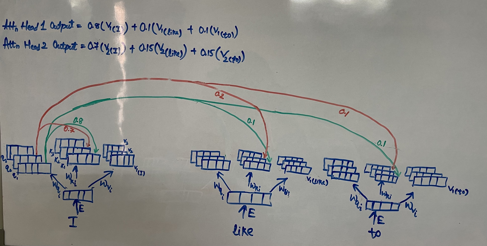

Transformers have become the synonymous of AI today. All the major AI models have been built on [transformers](https://arxiv.org/abs/1706.03762) architecture. And the magic of a transformer lies in its self-attention layer. In brief, inside self-attention every token attend (explicitly) every other token or all the previous tokens (depending on the type of self-attention) present in the input text, while generating a new token. This way transformer is able to capture context better than other deep learning model e.g. LSTM and hence they learn and remember better than other models. Details of transformers architecture or specifics of self-attention layer has been thoroughly explained by Jay Alammar in [this](https://jalammar.github.io/illustrated-transformer/) blog. Instead of revisiting those fundamentals, this discussion will focus on the limitations of self-attention, particularly regarding inference challenges related to compute and memory bandwidth. We will also explore alternative self-attention variants and examine how they improve inference and training efficiency.

### Important concepts covered:
- Multi Head Attention
- KV Cache
- GPU Inference Speed Calculation
- Multi Query Attention
- Grouped Query Attention
- Multi Head Latent Attention
- Paged Attention
- Flash Attention

## Multi Head Attention
In transformers the self-attention layer has multiple heads. In each head same attention operation is performed. But why same operation in all the heads? Idea is each head will capture or learn different kind of information (analogous to kernels in convolution layer) e.g. one head could learn [coreference resolution](https://medium.com/huggingface/state-of-the-art-neural-coreference-resolution-for-chatbots-3302365dcf30) in the input text while other head might focus more on the relationship between the subject and the object. Through multi-head attention transformers can model complex relationships and dependencies in the input text.

> Note each head has a separare query $$W_{qi}$$, key $$W_{ki}$$ and value $$W_{vi}$$ matrices. Hence, each head attention is able to capture or learn distinct relationship.

For the following text **"I like to"** multi-head attention would look like the below diagram

We have 3 attention heads hence 3 query, key and value vectors one ofr each head. Values like 

## KV Cache

## GPU Inference Speed Calculation

## Multi Query Attention

## Grouped Query Attention

## Multi Head Latent Attention

## Paged Attention
> To-Do

## Flash Attention
> To-Do

## References
- [A Unified MRC Framework for Named Entity Recognition](https://arxiv.org/pdf/1910.11476v6.pdf)
- [Question Answering with BERT](https://mccormickml.com/2020/03/10/question-answering-with-a-fine-tuned-BERT/#part-1-how-bert-is-applied-to-question-answering)
- [BERT Paper](https://arxiv.org/abs/1810.04805)
- [Hugging Face Transformers](https://github.com/huggingface/transformers)